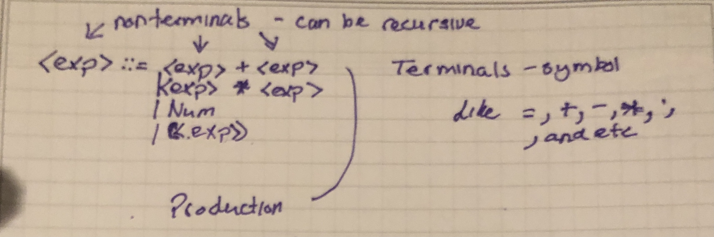

# Week 2-Reflection - Turorial by Jimmy Zhang
## Introductin- Syntaxs and Semantics
- **First off, what is programming?**

    Programming is the act of writing software to preform a particular task using a programming language uage

    Inorder to do that we need to know what sytnax and semantic are.

- **Sytnax** is the form of the expressions, statments, and  program units

- **Semantics** is the meaning of the expressions, statements, and program units
- **note: neither one can be ambiguous** 

- Syntax and semantics provide a lanuage's definition 

An example of this can be seen in the statement like this:

# Grammars
- **Grammars** are mechanism that are use to define the syntax, while **Mathematical constructs** like function and set are used to define the semantics

- grammar consists a set colledction of productions.

**Productions** use two kinds of structures, terminals(tokens) or non-termials

**Example:** 

- There is a special non-terminal symbol that appears in the initial string generated by the grammar called the start symbol --> ::=
- The sentences of the language are generated through a sequence of applications of the rules, beginning with a start symbol. Those rules are grammar and it is use to build a **parse trees** and derivation trees.
- **Note that the start symbol will alway be at the root of the tree.**
- # Another Symbol
- <empty> is the only non-terminal that does not have a rule defining it.
- The <empty> symbol derives nothing.
  
  **Ex:**
  
- By using the tree above we can prove if a sentence belongs to a certain grammar 
- Example of this would be if we use the sentence:" the dog love that cat" 
- In this case we know that the dog does belong in the noun phase however as we go to the next word love, it is not in the verb  which prove that the sentence do not belong to L(G)

**Example using programming language.**
    

 
**Example of Parse Tree**

    
However, problem still occurs 
Problem: it is ambiguous, meaning that there exists a string that can have more than one leftmost derivation or parse tree,
How do we fix that! We do it **Associativity and Precendence**
    
# Associativity and Precendence
  
  *Precedence* mean how tightly each of the operator are binding
  note parentheses have the highest precedence and is use to force an expression to evaluate.
  
  *Associativity* mean if two operator have the same precedence, the associativity tell how to disambiguate
  
  Most commonly use **left and right associative**
  using the grammar
  
  Left associative
  assuming that + and * are left associative with same precedence 
  ((5+7)+10)*3
  
  Right associative
  assuming that + and * are right associative with same precedence 
  5 +(7+(10*3))
  
However, (5+7)+(10 * 3) is what we are looking for because we want to express this according to algebraic conventions. note multiplication 10*3 would have the higher precedence because we are following it algebraically. In addition, it is left associative.

# Resource and references:
- Webber, Adam. Modern Programming Languages: A Practical Introduction. Franklin, Beedle &amp; Associates, 2002. 
- “7.6. Parse Tree¶.” 7.6. Parse Tree - Problem Solving with Algorithms and Data Structures, https://runestone.academy/ns/books/published/pythonds/Trees/ParseTree.html. 
- Chapter 3 Describing Syntax and Semantics. https://www2.southeastern.edu/Academics/Faculty/kyang/2014/Fall/CMPS401/ClassNotes/CMPS401ClassNotesChap03.pdf.
- “Language - (Grammar: Production) Rule.” Datacadamia, 7 Nov. 2021, https://datacadamia.com/code/compiler/rule.
- “Programming Languages.” 1.3. Grammars - Part 3 - Establishing Order of Operations - Programming Languages, https://opendsa-server.cs.vt.edu/OpenDSA/Books/PL/html/Grammars3.html. 

